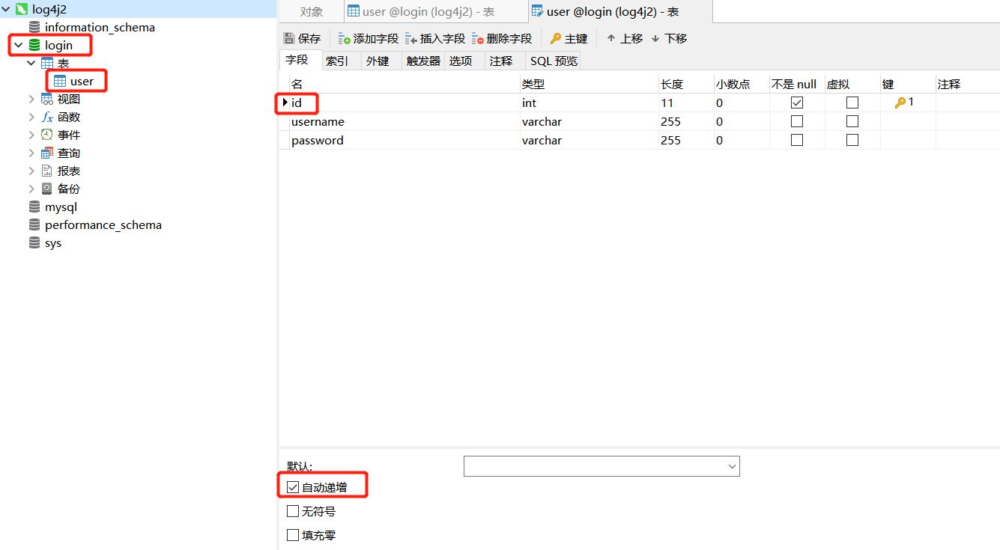
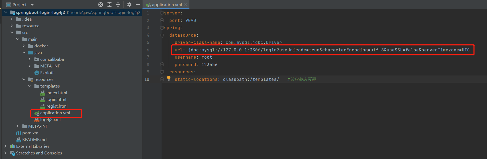
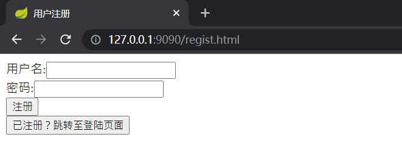
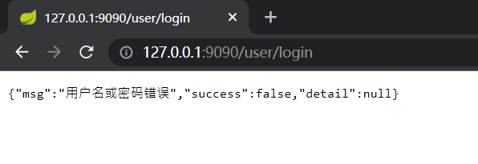
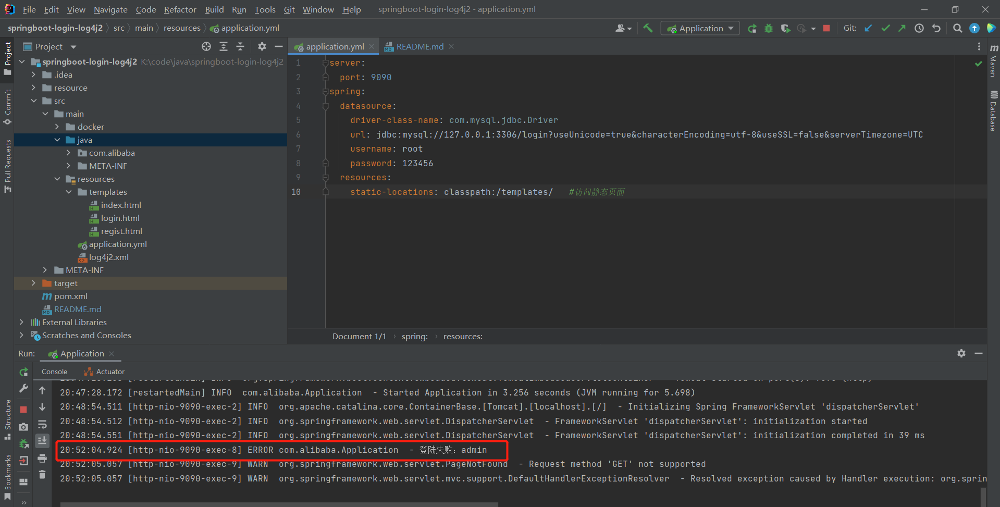

# springboot-login-log4j2

### 项目介绍

在laoyogd的[springboot-login](https://github.com/laoyog/springboot-login)项目的基础上引入了log4j2生成日志，作为复现CVE-2021-44228的靶场。

### docker一键部署

https://github.com/Ode1esse/springboot-login-log4j2-docker

### 本地调试
下载release的zip包，用idea打开。

需要起一个mysql服务，建立login数据库，在login数据库中创建user表，在user表中添加id,username,password字段，其中id字段的属性为自动递增。

然后修改application.xml文件中的jdbc url为你自己的mysql地址

运行之后访问http://127.0.0.1:9090

在登陆失败时会产生一条错误日志

